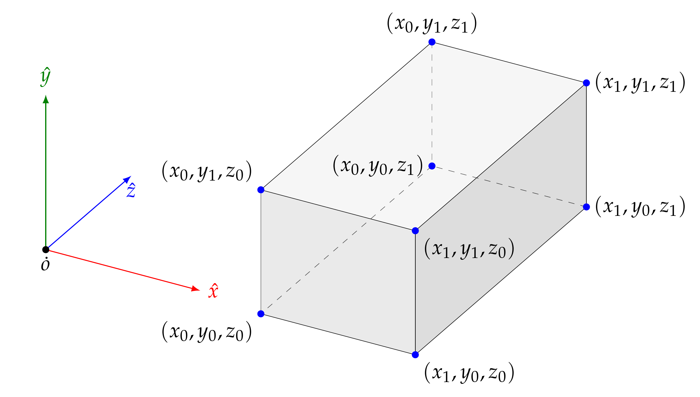

# figs-gen

## Procedurally generated PDF figures for Computer Graphics courses

This repository contains C++ source code which is used to generate **LaTex** source, which, in turn is compiled onto PDF files.
The latex source uses **Tikz** latex package. To create the PDFs, enter _pdfs_ folder and type `make all`. It requires an updated installation of
**texlive** or other package providing `pdflatex` command. To compile C++ code, `clang++` (or `gcc++`) command is required.
A PNG version for each PDF can be generated by using `make` on _pngs_ folder (it requires `pdftoppm` command from **poppler** package).

Current figures are these:

<h2>Figure 12</h2>

The default (initial) value for the **projection** matrix can be updated so the visible region can be set to any arbitrary **cuboid** or  **rectangular parallelepiped**

    

<h2>Figure 11</h2>

In OpenGL, the default (initial) value for the **modelview** and **projection** matrices is the identity matrix. So, initially, the visible region for OpenGL is a cube with size 2 and with center at the origin (world, camera, clip, and normalized device coordinates are all equal). Note that the Z axis points away in this view, which means that, when the depth test is enabled, primitives with lower Z values hide primitives with higher Z values.

    

<h2>Figure 10</h2>

The **normalized device coordinates** range from 0 to _nx_ y X, from 0 to _ny_ in Y, and from 0 to 1 in Z. The origin is
in the lower left vertex of the visible cuboid's front face. Integers _nx_ and _ny_ are the numbers of pixels columns and rows, respectively,
in the current viewport.

    

<h2>Figure 9</h2>

The scene from fig.8 is shown projected onto the clip coordinates space, after using a perspective projection matrix.

    

<h2>Figure 8</h2>

A scene is shown inside the perspective view frustum, aligned with the camera reference frame.

    

<h2>Figure 7</h2>

A _cuboid_ (or _orthoedron_) is shown, it is the visible region when an orthographic projection is used.
As in fig 5, the coordinates of the cuboid vertexes are shown, in terms of _l_,_r_,_b_,_t_,_n_ and _f_.
Helps to understand the parameters for `glOrtho` function.

    

<h2>Figure 6</h2>

The perspective view-frustum is shown, but here the _vertical field of view_ (an angle, _beta_) is emphasized. It is also shown how to
compute _l_,_r_,_b_ and _t_ parameters from _beta_,_n_,_f_,_a_ (aspect ratio). This is useful to understand the parameters
for `gluPerspective` function.

    

<h2>Figure 5</h2>

The perspective view-frustum is shown, along with the coordinates of its vertexes, in terms of _l_,_r_,_b_,_t_,_n_ and _f_.
These coordinates are relative to the camera reference system. This helps to understand the parameters for `glFrustum` function.

    

<h2>Figure 4</h2>

This figure shows how a vector (_s_) is rotated an angle (_beta_) around a unit-length axis vector (_e_).
The rotated vector is _t_+_w_,  that is, it is a linear combination of the three vectors (_u_,_v_ and _w_) in the reference frame
introduced in previous figure 3.

    

<h2>Figure 3</h2>

In order to define rotation in 3D, it is neccesary to compute an orthogonal reference frame (_u_,_v_,_w_,_o_) which is
aligned with the original vector _s_ and axis _e_. This can be donde by using dot and cross products, but
it is also possible to obtain the frame by just using the _P_ operator, as shown.

    

<h2>Figure 2</h2>

The rotation in 2D is defined by using a combination of the original vector _u_ and its perpendicular vector _v_. This combination
uses the _sin_ and _cos_ functions, as shown.

    

<h2>Figure 1</h2>

In order to define the rotation in 2D, we can introduce the operator _P_, which outputs a perpendicular vector to another given vector (but with the same length).
This can be easily done by using the coordinates of the original vector, in a Cartesian coordinate system, as it is shown here.

    

