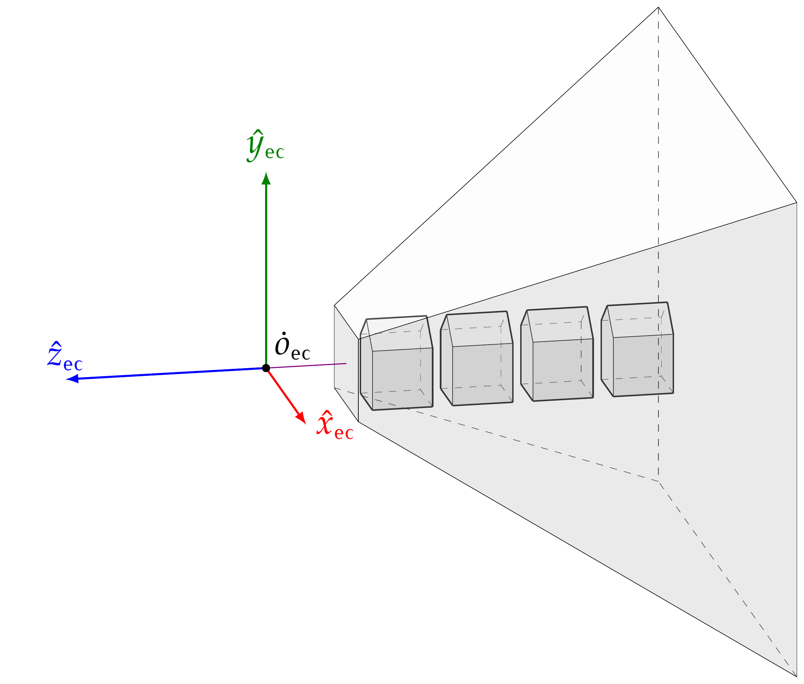

# figs-gen 

## Procedurally generated PDF figures for Computer Graphics courses

This repository contains C++ source code which is used to generate LaTex source, which, in turn is compiled onto PDF files. 
The latex source uses Tikz latex package. To create the PDFs, enter `pdf` folder and type `make all`. It requires an updated installation of 
'texlive' or other package provinding 'pdflatex' command. To compile C++ code, `clang++` (or `gcc++`) command is required.
A PNG version for each PDF can be generated by using 'make' on 'pngs' folder (it requires `pdftoppm` command from `poppler` package).

Current figures are these:

<h2>Figure 9</h2>

The scene from fig.8 is shown projected onto the clip coordinates space, after using a perspective projection projection matrix.

     

	

<h2>Figure 8</h2>

A scene is shown inside the perspective view frustum, aligned with the camera reference frame.

     

<h2>Figure 7</h2>

A cuboid (or orthoedron) is shown, it is the visible region when an orthographic projection is used. 
As in fig 5, the coordinates of the cuboid vertexes are shown, in terms of l,r,b,t,n and f.

     

<h2>Figure 6</h2>

The perspective view-frustum is shown, but here the hfovy angle (beta) is emphasized. It is also shown how to 
compute l,r,b and t parameters from beta and n,f,a (aspect ratio). This is usefull to ubnserstand the parameters 
for `gluPerspective` function. 

     

<h2>Figure 5</h2>

The perspective view-frustum is shown, along with the coordinates of its vertexes, in terms of l,r,b,t,n and f. 
These coordinates are relative to the camera reference system.

     

fig05-frustum1.png	

fig04-rot3d.png

fig03-perp3d.png

fig02-rot2d.png

fig01-perp2d.png

fig00-test.png